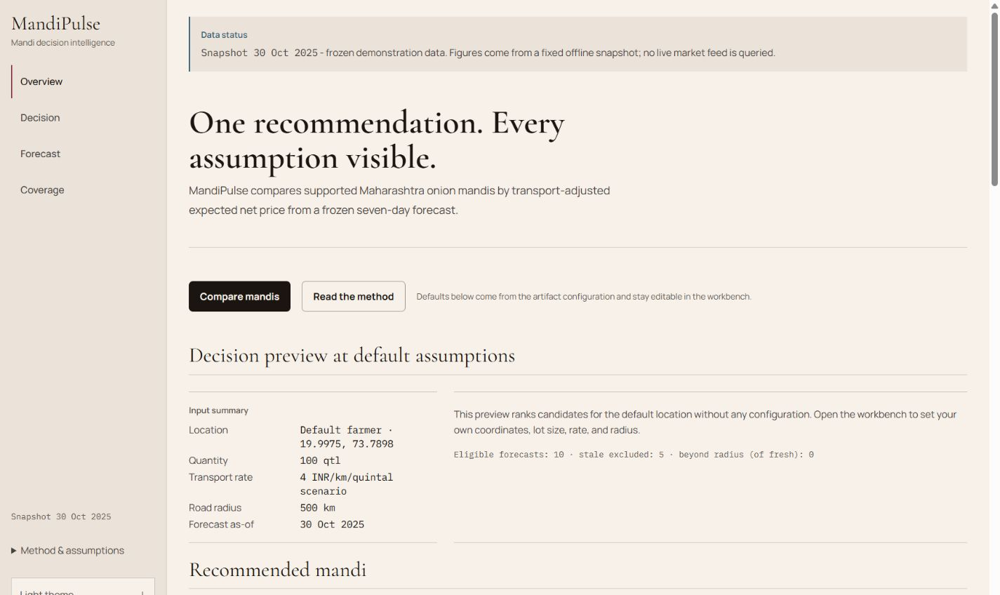
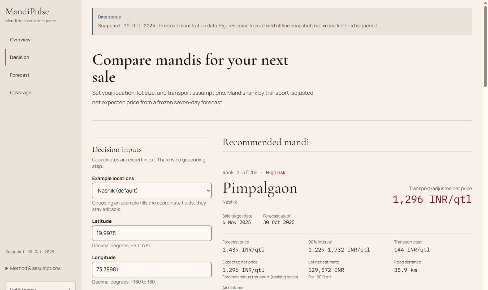
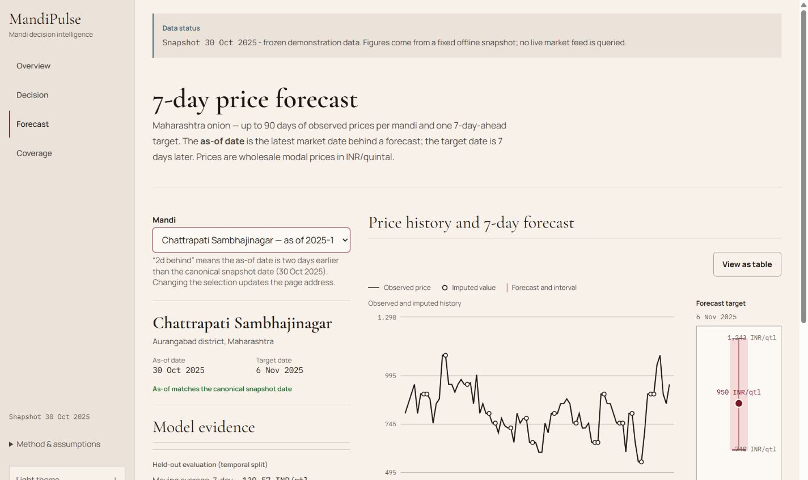
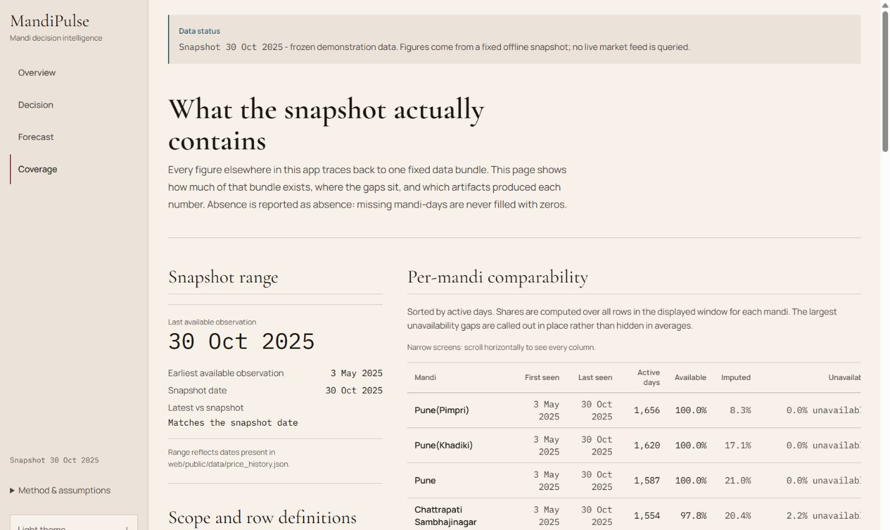
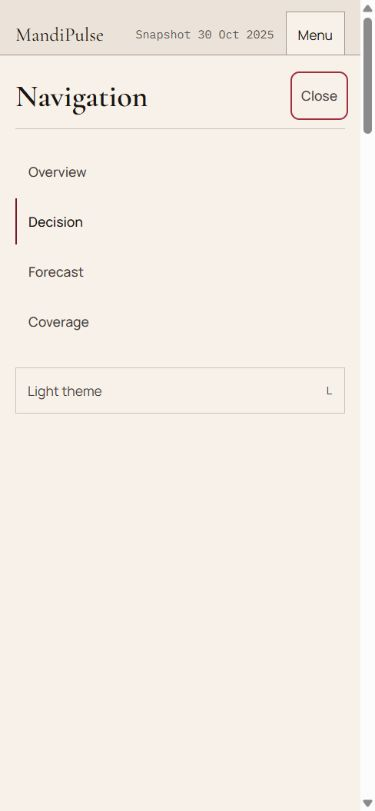
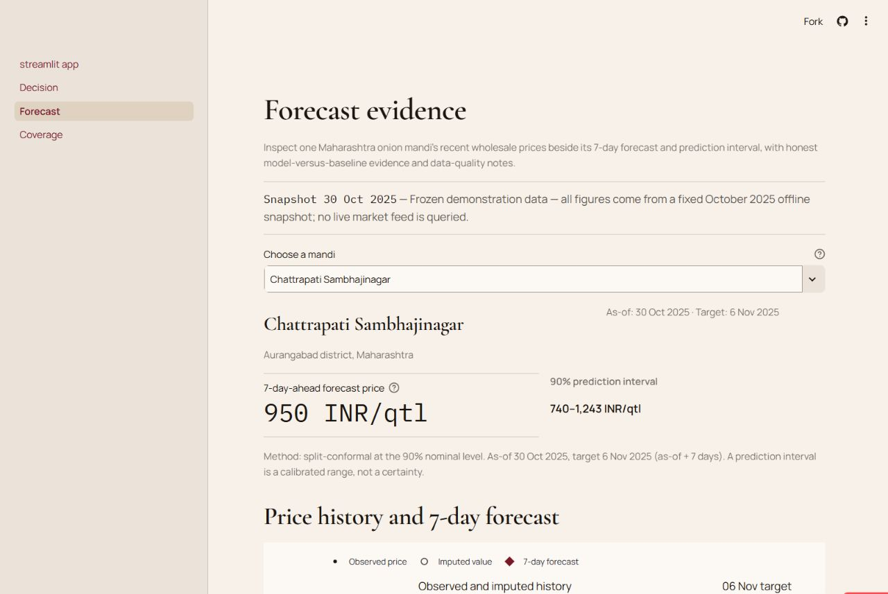

# MandiPulse India

A transport-aware decision tool for comparing Maharashtra onion mandis.

[](tests/)
[](pyproject.toml)
[](pyproject.toml)
[](web/package.json)

MandiPulse forecasts onion prices seven days ahead, estimates transport cost, and ranks eligible
mandis by expected net price. The demo covers 15 Maharashtra mandis using a frozen snapshot that
ends on 2025-10-30. It is a reproducible portfolio project, not a live market feed.

## Live demos

- [Next.js product on Vercel](https://mandipulse-ten.vercel.app/): primary portfolio surface
- [Streamlit analytical dashboard](https://mandipulse.streamlit.app/): technical review surface

## What it does

A user provides a location, lot size, transport rate, and maximum travel radius. MandiPulse then:

1. selects forecasts available on the canonical as-of date
2. estimates road distance from haversine distance and a 1.3 road factor
3. subtracts estimated transport cost from forecast price
4. returns a ranked shortlist with alternatives, intervals, assumptions, and source coverage

The current uncertainty interval has one global width. It is useful evidence, but it does not
change candidate order. Ranking is based on transport-adjusted net expected price.

## Interface

These light-mode screenshots were captured from the deployed apps. Each image links to the route it shows.

| Overview (light mode) | Decision workbench |
| --- | --- |
| [](https://mandipulse-ten.vercel.app/) | [](https://mandipulse-ten.vercel.app/recommend/) |

| Forecast evidence | Coverage and provenance |
| --- | --- |
| [](https://mandipulse-ten.vercel.app/forecast/) | [](https://mandipulse-ten.vercel.app/coverage/) |

| Mobile decision flow | Streamlit dashboard |
| --- | --- |
| [](https://mandipulse-ten.vercel.app/recommend/) | [](https://mandipulse.streamlit.app/Forecast) |

## How it works

```text
cached CEDA and AGMARKNET extract
    -> clean daily price panel
    -> leakage-safe lag and rolling features
    -> temporal train, validation, and test splits
    -> model comparison and seven-day moving-average forecast
    -> empirical residual interval
    -> transport-adjusted recommendation ranking
    -> committed CSV and JSON artifacts
    -> Next.js static site and Streamlit dashboard
```

The Python package in `src/mandipulse/` owns data access, forecasting, evaluation, and ranking. The
Next.js app in `web/` is the main product surface. Streamlit in `app/` provides a second view for
technical review. Both read committed artifacts, so the portfolio build needs no runtime backend,
database, or API key.

Python and TypeScript ranking results are checked against shared fixtures within 0.01 INR per
quintal. Eight public JSON files are validated for schema shape, finite values, provenance, and
manifest hashes before release.

## Results

The shipped model is a seven-day moving average because it beat the more complex candidates on the
held-out public test split.

| Model | Test MAE | Shipped |
| --- | ---: | --- |
| Seven-day moving average | 139.57 INR per quintal | Yes |
| LightGBM | 188.20 INR per quintal | No |
| LightGBM residual | 195.63 INR per quintal | No |
| Ridge | 224.43 INR per quintal | No |

The observed-target Phase 3 holdout contains 792 rows and reports 133.61 INR per quintal MAE. Its
split-conformal interval covered 90.91% of observed targets. The broader public all-row evaluation
reported 86.71% coverage against a 90% nominal level.

The recommendation backtest covers 90 historical dates. Mean regret at rank 1 was 296.3 INR per
quintal, compared with 370.1 for the nearest-mandi baseline. The recommendation beat that baseline
on 74.4% of evaluated dates. These are offline backtest results, not profit claims.

## Run locally (optional)

The static product only needs Node.js 20.9 or newer:

```powershell
git clone https://github.com/kaustubh-dot/MandiPulse.git
cd MandiPulse\web
npm ci
npm run dev
```

The public frontend is available at [mandipulse-ten.vercel.app](https://mandipulse-ten.vercel.app/).

To run the Streamlit dashboard, use Python 3.11 or newer from the repository root:

```powershell
cd MandiPulse
python -m venv .venv
.\.venv\Scripts\Activate.ps1
python -m pip install -e ".[dev]"
streamlit run app\streamlit_app.py
```

The public dashboard is available at [mandipulse.streamlit.app](https://mandipulse.streamlit.app/).

## Test and build

Python checks from the repository root:

```powershell
ruff check app src scripts tests
black --check app src scripts tests
pytest -q
python scripts\validate_web_export.py
```

The current local result is 208 passing tests with 77.59% coverage.

Web checks from `web/`:

```powershell
npm run lint
npm run typecheck
npm test
npm run test:components
npm run build
npm run test:e2e
```

The recorded web suite contains 140 unit assertions, 44 component checks, and 89 passing Playwright
checks, with three viewport-specific skips.

## Deployment

There is no backend deployment. Use Vercel for the Next.js site and Streamlit Community Cloud for
the analytical dashboard. Hugging Face Static Spaces can host the exported Next.js site as an
alternative portfolio URL.

The exact setup fields, build commands, and verification checklist are in
[`docs/DEPLOYMENT.md`](docs/DEPLOYMENT.md).

## Limits

- Data ends on 2025-10-30, so results are not current market guidance.
- Transport cost is a configurable scenario, not a carrier quote.
- Distance is an approximation, not routing-engine output.
- Prediction intervals are empirical ranges, not guarantees.
- Scope is limited to one crop, one state, 15 mandis, and a seven-day horizon.
- The evaluation does not establish causal effects, future performance, or profit improvement.

## Project references

- [Product brief](PRODUCT.md)
- [Architecture](docs/ARCHITECTURE.md)
- [Data sources](docs/DATA_SOURCES.md)
- [Modeling reports](reports/modeling/)
- [Release runbook](RELEASE.md)
- [Release gates](docs/portfolio/RELEASE_GATES.md)
- [Golden fixtures](tests/golden/)

## License

This project is released under the [MIT License](LICENSE).
