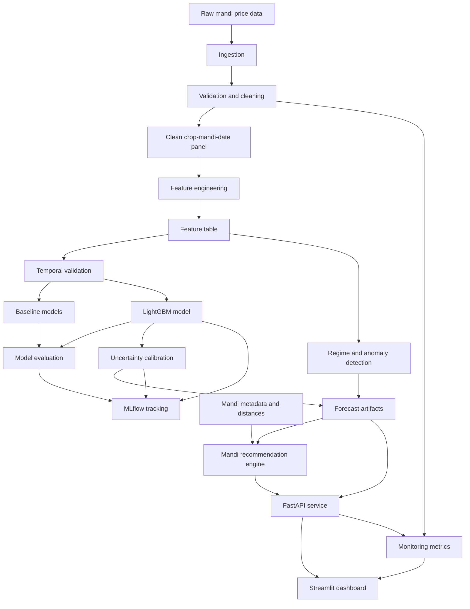
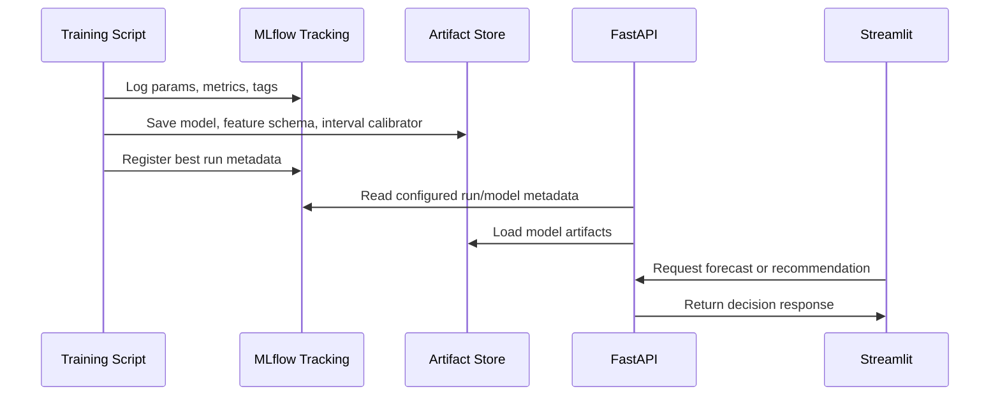

# MandiPulse India Architecture

## High-Level System Architecture

MandiPulse is a batch-trained, API-served decision intelligence system. Historical mandi data is ingested, cleaned, validated, transformed into crop-mandi-date features, used for temporal forecasting, wrapped with uncertainty intervals, and converted into transport-cost-aware recommendations.

The main product output is not only a forecast. It is a recommendation with forecast, uncertainty, transport cost, risk, and regime context.

## Architecture Diagram



## Data Layer

### Responsibilities

- Ingest raw mandi price records for the selected MVP scope from CEDA / AGMARKNET.
- Resolve CEDA commodity, state, district, and market IDs before price ingestion.
- Preserve a raw layer for reproducibility.
- Create a cleaned crop-mandi-date panel.
- Store processed tables in DuckDB or Parquet.
- Validate data quality before training.

### Main Tables

| Table | Purpose |
|---|---|
| `raw_mandi_prices` | Source records with minimal transformation |
| `clean_mandi_prices` | Normalized dates, names, units, prices, arrivals |
| `mandi_metadata` | State, district, coordinates, normalized names |
| `weather_features` | Optional daily weather by mandi/district |
| `feature_table` | Model-ready crop-mandi-date features |

## Feature Engineering Layer

### Responsibilities

- Create lag features: 1, 3, 7, 14, 30 days.
- Create rolling mean, median, standard deviation, and volatility.
- Create returns and price momentum.
- Add day-of-week, month, season, and optional holiday/festival indicators.
- Add arrival quantity features if available.
- Add weather features if feasible.
- Add distance or transport-related features for recommendations.

### Design Rule

Feature functions should be deterministic, modular, and tested. They must never use future data when creating training rows.

## Modeling Layer

### Responsibilities

- Train baseline models.
- Train the primary LightGBM model. CatBoost is a P1 comparison if time allows.
- Use temporal validation only.
- Compare all models using MAE, RMSE, sMAPE, and MASE.
- Save best model artifacts and metadata.
- Log experiments to MLflow.

### Model Families

| Model | Role |
|---|---|
| Seasonal naive | Mandatory baseline |
| Moving average | Mandatory baseline |
| Linear/Ridge | Mandatory baseline |
| LightGBM | Primary MVP model |
| CatBoost | P1 comparison model if time allows |
| ARIMA/SARIMA | Optional for selected crop-mandi diagnostics only |

### Temporal Validation Strategy

Default approach: single global date-based cutoff split.

| Split | Rule |
|---|---|
| Train | All data before `cutoff_date` |
| Validation | `cutoff_date` to `cutoff_date + validation_days` (default 90 days) |
| Test | All data after validation end |

Split configuration:

- Reserve approximately the latest 6 months of available data for validation and test combined.
- All remaining earlier data is used for training.
- Split dates must be logged with every MLflow experiment run.

Minimum history requirements:

- Exclude mandis with fewer than 180 clean price days from model training.
- Mandis excluded for insufficient history must be documented and flagged in mandi metadata.

Rolling or walk-forward validation may be added as an improvement after initial fixed-split results are established.

## Uncertainty Layer

### Responsibilities

- Produce lower and upper forecast bounds.
- Target a documented confidence level, usually 0.90.
- Evaluate empirical coverage and interval width.
- Expose uncertainty to the recommendation layer as a penalty.

### Preferred Method

Use conformal prediction with MAPIE if compatible with the model setup. If not, use quantile regression or residual-based intervals and clearly document the tradeoff.

## Recommendation Layer

### Responsibilities

- Estimate transport cost per quintal from farmer location to candidate mandis.
- Combine forecast price, transport cost, and uncertainty penalty.
- Rank candidate mandis.
- Return recommended mandi, alternatives, and explanation.

### Core Formula

```text
expected_net_price = forecast_price - estimated_transport_cost
risk_adjusted_score = expected_net_price - uncertainty_penalty
```

### Inputs

- Crop
- Farmer latitude and longitude
- Candidate states
- Forecast horizon
- Quantity in quintals
- Candidate mandi metadata
- Forecast output with uncertainty

### Transport Cost Model (MVP)

The MVP uses a simple distance-based cost estimate. This is an approximation, not a production-grade routing system.

Formula:

```text
haversine_km = haversine(farmer_lat_lon, mandi_lat_lon)
road_km = haversine_km * ROAD_DISTANCE_FACTOR
transport_cost_per_qtl = road_km * COST_PER_KM_PER_QTL
total_transport_cost = transport_cost_per_qtl * quantity_quintal
```

Default parameters (configurable in `configs/recommendation.yaml`):

| Parameter | Default | Description |
|---|---|---|
| `cost_per_km_per_quintal` | 4.0 INR | Flat transport rate |
| `road_distance_factor` | 1.3 | Multiplier to approximate road distance from haversine |
| `max_transport_radius_km` | 500 | Maximum considered distance; mandis beyond this are excluded |

Assumptions:

- Flat rate per km per quintal regardless of truck type or load size.
- No volume discounts or seasonal rate variation.
- Road distance is approximated from haversine, not from routing APIs.
- All assumptions must be documented and visible in the dashboard.

Sensitivity: The dashboard should show how the recommendation changes at plus or minus 20 percent transport cost variation to demonstrate robustness.

## Regime and Anomaly Layer

### Responsibilities

- Classify current market condition as normal, volatile, or crisis/anomaly.
- Provide a human-readable reason.
- Detect recent abnormal price movements.
- Support dashboard monitoring and forecast context.

### MVP Methods

- Rolling volatility threshold.
- Z-score anomaly detection on price returns.
- Isolation Forest if it adds value without complexity.

Hidden Markov Models are optional future work.

## API Layer

### Responsibilities

- Provide a stable contract for dashboard and demos.
- Validate requests with Pydantic.
- Load model artifacts and metadata.
- Return forecast, recommendation, regime, and monitoring responses.
- Provide health and metrics endpoints.

### MVP Endpoints

| Endpoint | Responsibility |
|---|---|
| `GET /health` | API, model, and data availability status |
| `POST /forecast` | Forecast price with uncertainty and regime |
| `POST /recommend` | Rank mandis after transport cost and uncertainty penalty |
| `GET /regime` | Current regime/anomaly state for crop/mandi |
| `GET /metrics` | Data quality, freshness, model, and API metrics |

## Dashboard Layer

### Responsibilities

- Provide an interview-ready product interface.
- Surface the decision, not only model outputs.
- Present charts, tables, maps, and monitoring status.
- Keep the experience data-heavy but readable.

### Pages

1. Overview
2. Forecast
3. Mandi Recommendation
4. Regime / Anomaly
5. Monitoring

## Monitoring Layer

### Responsibilities

- Track latest data date.
- Track missing value percentage by crop/state/mandi.
- Track recent forecast error when actuals are available.
- Track drift indicators for selected features.
- Track inference success and API latency.

### MVP Monitoring Outputs

| Output | Source |
|---|---|
| Data freshness | Cleaned price table |
| Missing data rate | Validation report |
| Drift score | Feature table comparison or Evidently report |
| Recent forecast error | Backtest/prediction logs |
| Model version | MLflow run metadata |
| API status | FastAPI health and request logs |

## MLflow and Model Artifact Flow



### Required Artifacts

- Model artifact.
- Feature column list and schema.
- Validation metrics.
- Uncertainty/calibration object.
- Regime detector thresholds or model.
- Mandi metadata snapshot.
- Data quality report.

## Docker / Deployment Structure

### MVP Containers

| Service | Purpose |
|---|---|
| `api` | FastAPI app |
| `dashboard` | Streamlit app |
| `mlflow` | Optional local tracking UI |

### Shared Volumes

- Processed data.
- Model artifacts.
- MLflow runs if needed for demo.

### Deployment Boundary

Docker Compose is enough for MVP. Do not introduce Kubernetes, service mesh, message queues, or distributed orchestration.

## Configuration Files

All runtime parameters must be managed through YAML config files under `configs/`, not hardcoded in source modules.

### `configs/data.yaml`

- `mvp_crops`: list of MVP crop names (default: `["onion", "tomato"]`)
- `mvp_states`: list of MVP state names (default: `["maharashtra", "karnataka", "uttar_pradesh"]`)
- `mvp_mandi_list`: path to curated mandi list CSV or inline list (populated after EDA)
- `raw_data_path`: path to raw data directory (default: `data/raw/`)
- `processed_data_path`: path to processed data (default: `data/processed/`)
- `duckdb_path`: path to DuckDB database file (default: `data/processed/mandipulse.duckdb`)
- `min_history_days`: minimum clean price days for mandi inclusion (default: 180)
- `data_source_api_key_env`: environment variable name for the primary data-source token, currently `CEDA_API_TOKEN`
- `mandi_aliases`: mapping of known mandi spelling variants to canonical names
- `crop_aliases`: mapping of known crop spelling variants to canonical names

### `configs/model.yaml`

- `horizons`: list of forecast horizons in days (default: `[7, 14, 30]`)
- `features`: ordered list of feature column names used for training
- `target_prefix`: target column naming pattern (default: `target_price_t_plus_`)
- `validation_split`:
  - `method`: `fixed_cutoff` or `rolling`
  - `validation_days`: default 90
  - `test_days`: default 90
- `lightgbm_params`: dictionary of LightGBM hyperparameters
- `catboost_params`: dictionary of CatBoost hyperparameters (used only for P1 comparison)
- `baseline_models`: list of baselines to run (default: `["seasonal_naive", "moving_average", "ridge"]`)
- `metrics`: list of evaluation metrics (default: `["mae", "rmse", "smape", "mase"]`)
- `confidence_level`: default 0.90

### `configs/recommendation.yaml`

- `cost_per_km_per_quintal`: default 4.0 INR
- `road_distance_factor`: default 1.3
- `max_transport_radius_km`: default 500
- `uncertainty_penalty_weight`: default 0.3 (multiplied by interval width)
- `risk_thresholds`:
  - `low_max_interval_pct`: 10 (interval width below 10 percent of forecast price equals low risk)
  - `high_min_interval_pct`: 25 (interval width above 25 percent of forecast price equals high risk)
- `max_alternatives`: default 10

### `configs/app.yaml`

- `api_host`: default `0.0.0.0`
- `api_port`: default 8000
- `dashboard_port`: default 8501
- `mlflow_tracking_uri`: default `./mlruns`
- `log_level`: default `INFO`
- `model_artifact_path`: path to saved model artifacts
- `api_version`: default `0.1.0`

## Project Directory Structure

```text
mandipulse/
├── README.md
├── LICENSE
├── pyproject.toml
├── Makefile
├── Dockerfile
├── docker-compose.yml
├── .env.example
├── .gitignore
│
├── .github/
│   └── workflows/
│       └── ci.yml
│
├── configs/
│   ├── data.yaml
│   ├── model.yaml
│   ├── recommendation.yaml
│   └── app.yaml
│
├── data/
│   ├── raw/
│   ├── interim/
│   ├── processed/
│   └── data_dictionary.md
│
├── notebooks/
│   ├── 01_eda_data_quality.ipynb
│   ├── 02_baseline_forecasting.ipynb
│   ├── 03_model_training_and_backtesting.ipynb
│   ├── 04_uncertainty_conformal_prediction.ipynb
│   ├── 05_recommendation_engine.ipynb
│   └── 06_regime_anomaly_detection.ipynb
│
├── src/
│   └── mandipulse/
│       ├── __init__.py
│       ├── config.py
│       ├── data/
│       │   ├── __init__.py
│       │   ├── ingestion.py
│       │   ├── validation.py
│       │   ├── preprocessing.py
│       │   └── schemas.py
│       ├── features/
│       │   ├── __init__.py
│       │   ├── time_features.py
│       │   ├── price_features.py
│       │   ├── weather_features.py
│       │   └── distance_features.py
│       ├── models/
│       │   ├── __init__.py
│       │   ├── baselines.py
│       │   ├── trainer.py
│       │   ├── forecaster.py
│       │   ├── uncertainty.py
│       │   └── evaluation.py
│       ├── recommendation/
│       │   ├── __init__.py
│       │   ├── transport_cost.py
│       │   ├── mandi_ranker.py
│       │   └── regret_metrics.py
│       ├── regime/
│       │   ├── __init__.py
│       │   ├── anomaly_detector.py
│       │   └── regime_classifier.py
│       ├── explainability/
│       │   ├── __init__.py
│       │   ├── shap_explainer.py
│       │   └── narratives.py
│       ├── monitoring/
│       │   ├── __init__.py
│       │   ├── data_drift.py
│       │   ├── data_quality.py
│       │   └── performance_monitor.py
│       └── api/
│           ├── __init__.py
│           ├── main.py
│           ├── routes/
│           │   ├── health.py
│           │   ├── forecast.py
│           │   ├── recommend.py
│           │   ├── regime.py
│           │   └── metrics.py
│           └── response_models.py
│
├── dashboard/
│   ├── app.py
│   ├── pages/
│   │   ├── 1_overview.py
│   │   ├── 2_forecast.py
│   │   ├── 3_recommendation.py
│   │   ├── 4_regime_anomaly.py
│   │   └── 5_monitoring.py
│   └── components/
│       ├── charts.py
│       ├── maps.py
│       └── tables.py
│
├── tests/
│   ├── unit/
│   │   ├── test_features.py
│   │   ├── test_forecaster.py
│   │   ├── test_uncertainty.py
│   │   ├── test_recommendation.py
│   │   └── test_regime.py
│   ├── integration/
│   │   └── test_api.py
│   └── conftest.py
│
├── docs/
│   ├── PRD.md
│   ├── TECH_STACK.md
│   ├── ARCHITECTURE.md
│   ├── APP_FLOW.md
│   ├── DATA_SCHEMA.md
│   ├── API_SPEC.md
│   ├── IMPLEMENTATION_PLAN.md
│   ├── TRACKER.md
│   ├── RULES.md
│   └── DESIGN.md
│
├── reports/
│   ├── figures/
│   ├── model_card.md
│   └── final_report.md
│
├── artifacts/
│   ├── models/
│   ├── predictions/
│   └── monitoring/
│
└── mlruns/
```

Notes:

- `data/raw/` contains raw API and CSV downloads. Not committed if large.
- `data/processed/` contains cleaned tables and DuckDB file. Not committed.
- `mlruns/` is MLflow local tracking. Not committed.
- `artifacts/` is for saved model artifacts. Not committed unless lightweight.
- `configs/` is committed and version-controlled.
- `docs/` contains all planning and reference documentation.

## Advanced Modules Boundary

| Module | Status | Notes |
|---|---|---|
| Arbitrage detection | Future/P2 | Lightweight opportunity analysis only after recommendation works |
| Price propagation graph | Future/P2 | Use predictive transmission wording, not causal propagation |
| Causal inference | Future/P2 research | Must avoid strong causal claims |
| Similar historical days | Future/P2 | Useful interview feature after MVP |
