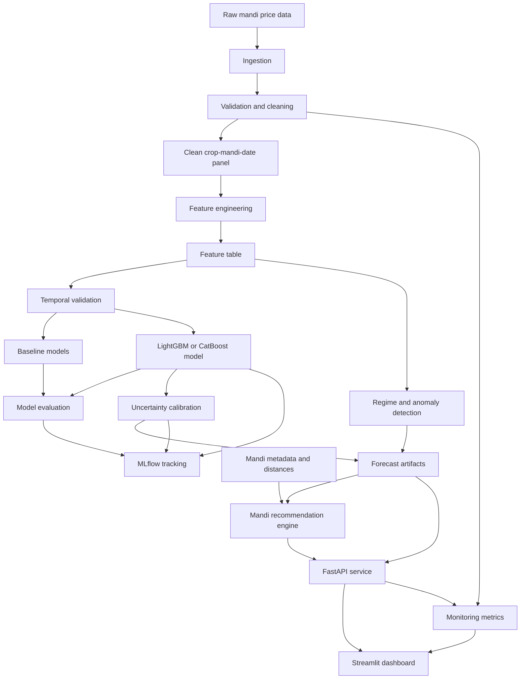
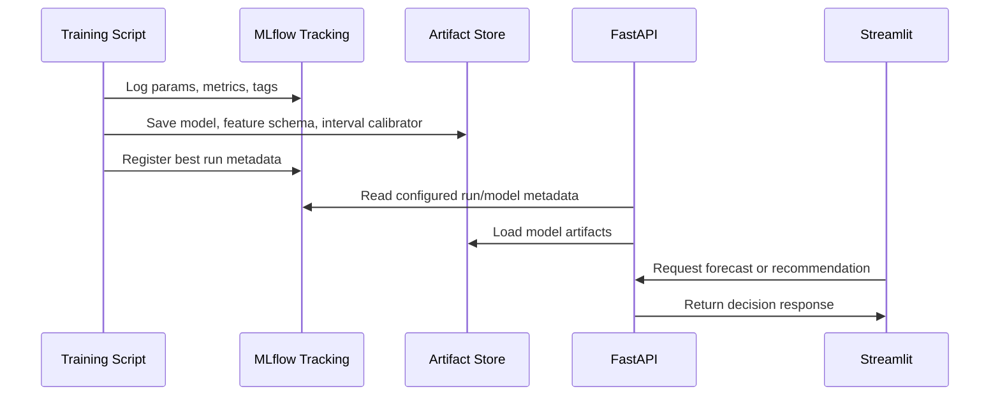

# MandiPulse India Architecture

## High-Level System Architecture

MandiPulse is a batch-trained, API-served decision intelligence system. Historical mandi data is ingested, cleaned, validated, transformed into crop-mandi-date features, used for temporal forecasting, wrapped with uncertainty intervals, and converted into transport-cost-aware recommendations.

The main product output is not only a forecast. It is a recommendation with forecast, uncertainty, transport cost, risk, and regime context.

## Architecture Diagram



## Data Layer

### Responsibilities

- Ingest raw mandi price records for the selected MVP scope.
- Preserve a raw layer for reproducibility.
- Create a cleaned crop-mandi-date panel.
- Store processed tables in DuckDB or Parquet.
- Validate data quality before training.

### Main Tables

| Table | Purpose |
|---|---|
| `raw_mandi_prices` | Source records with minimal transformation |
| `clean_mandi_prices` | Normalized dates, names, units, prices, arrivals |
| `mandi_metadata` | State, district, coordinates, normalized names |
| `weather_features` | Optional daily weather by mandi/district |
| `feature_table` | Model-ready crop-mandi-date features |

## Feature Engineering Layer

### Responsibilities

- Create lag features: 1, 3, 7, 14, 30 days.
- Create rolling mean, median, standard deviation, and volatility.
- Create returns and price momentum.
- Add day-of-week, month, season, and optional holiday/festival indicators.
- Add arrival quantity features if available.
- Add weather features if feasible.
- Add distance or transport-related features for recommendations.

### Design Rule

Feature functions should be deterministic, modular, and tested. They must never use future data when creating training rows.

## Modeling Layer

### Responsibilities

- Train baseline models.
- Train the main LightGBM or CatBoost model.
- Use temporal validation only.
- Compare all models using MAE, RMSE, sMAPE, and MASE.
- Save best model artifacts and metadata.
- Log experiments to MLflow.

### Model Families

| Model | Role |
|---|---|
| Seasonal naive | Mandatory baseline |
| Moving average | Mandatory baseline |
| Linear/Ridge | Mandatory baseline |
| LightGBM or CatBoost | Main MVP model |
| ARIMA/SARIMA | Optional for selected crop-mandi diagnostics only |

## Uncertainty Layer

### Responsibilities

- Produce lower and upper forecast bounds.
- Target a documented confidence level, usually 0.90.
- Evaluate empirical coverage and interval width.
- Expose uncertainty to the recommendation layer as a penalty.

### Preferred Method

Use conformal prediction with MAPIE if compatible with the model setup. If not, use quantile regression or residual-based intervals and clearly document the tradeoff.

## Recommendation Layer

### Responsibilities

- Estimate transport cost per quintal from farmer location to candidate mandis.
- Combine forecast price, transport cost, and uncertainty penalty.
- Rank candidate mandis.
- Return recommended mandi, alternatives, and explanation.

### Core Formula

```text
expected_net_price = forecast_price - estimated_transport_cost
risk_adjusted_score = expected_net_price - uncertainty_penalty
```

### Inputs

- Crop
- Farmer latitude and longitude
- Candidate states
- Forecast horizon
- Quantity in quintals
- Candidate mandi metadata
- Forecast output with uncertainty

## Regime and Anomaly Layer

### Responsibilities

- Classify current market condition as normal, volatile, or crisis/anomaly.
- Provide a human-readable reason.
- Detect recent abnormal price movements.
- Support dashboard monitoring and forecast context.

### MVP Methods

- Rolling volatility threshold.
- Z-score anomaly detection on price returns.
- Isolation Forest if it adds value without complexity.

Hidden Markov Models are optional future work.

## API Layer

### Responsibilities

- Provide a stable contract for dashboard and demos.
- Validate requests with Pydantic.
- Load model artifacts and metadata.
- Return forecast, recommendation, regime, and monitoring responses.
- Provide health and metrics endpoints.

### MVP Endpoints

| Endpoint | Responsibility |
|---|---|
| `GET /health` | API, model, and data availability status |
| `POST /forecast` | Forecast price with uncertainty and regime |
| `POST /recommend` | Rank mandis after transport cost and uncertainty penalty |
| `GET /regime` | Current regime/anomaly state for crop/mandi |
| `GET /metrics` | Data quality, freshness, model, and API metrics |

## Dashboard Layer

### Responsibilities

- Provide an interview-ready product interface.
- Surface the decision, not only model outputs.
- Present charts, tables, maps, and monitoring status.
- Keep the experience data-heavy but readable.

### Pages

1. Overview
2. Forecast
3. Mandi Recommendation
4. Regime / Anomaly
5. Monitoring

## Monitoring Layer

### Responsibilities

- Track latest data date.
- Track missing value percentage by crop/state/mandi.
- Track recent forecast error when actuals are available.
- Track drift indicators for selected features.
- Track inference success and API latency.

### MVP Monitoring Outputs

| Output | Source |
|---|---|
| Data freshness | Cleaned price table |
| Missing data rate | Validation report |
| Drift score | Feature table comparison or Evidently report |
| Recent forecast error | Backtest/prediction logs |
| Model version | MLflow run metadata |
| API status | FastAPI health and request logs |

## MLflow and Model Artifact Flow



### Required Artifacts

- Model artifact.
- Feature column list and schema.
- Validation metrics.
- Uncertainty/calibration object.
- Regime detector thresholds or model.
- Mandi metadata snapshot.
- Data quality report.

## Docker / Deployment Structure

### MVP Containers

| Service | Purpose |
|---|---|
| `api` | FastAPI app |
| `dashboard` | Streamlit app |
| `mlflow` | Optional local tracking UI |

### Shared Volumes

- Processed data.
- Model artifacts.
- MLflow runs if needed for demo.

### Deployment Boundary

Docker Compose is enough for MVP. Do not introduce Kubernetes, service mesh, message queues, or distributed orchestration.

## Advanced Modules Boundary

| Module | Status | Notes |
|---|---|---|
| Arbitrage detection | Future/P2 | Lightweight opportunity analysis only after recommendation works |
| Price propagation graph | Future/P2 | Use predictive transmission wording, not causal propagation |
| Causal inference | Future/P2 research | Must avoid strong causal claims |
| Similar historical days | Future/P2 | Useful interview feature after MVP |

