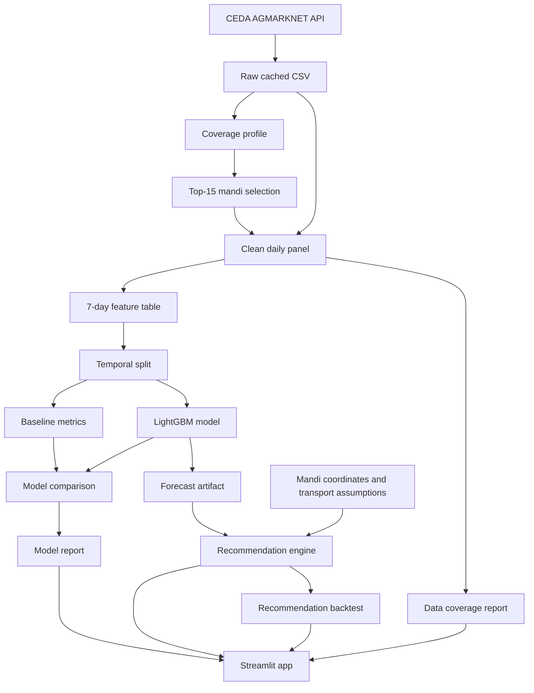

# MandiPulse Architecture

## Current MVP Shape

MandiPulse is now an offline decision-intelligence MVP, not a live data platform.

Scope:

- Crop: Onion only.
- State: Maharashtra only.
- Markets: 15 selected mandis.
- Forecast horizon: 7 days only.
- Interface: Streamlit app reading local artifacts.
- Data source: cached CEDA/AGMARKNET extract.

The project should first prove one useful loop:

```text
cached CEDA data -> clean daily mandi panel -> leakage-safe features -> baselines -> 7-day model -> uncertainty -> transport-aware recommendation -> Streamlit demo
```

FastAPI, live monitoring, regime/anomaly detection, extra crops, extra states, and 14/30-day horizons are post-MVP.

## Data Flow



The Recommendation page reads the backtest artifact (`artifacts/recommendations/recommendation_backtest_7d.csv`) as optional context. If absent, it shows a guidance message; the live ranking still renders.

## Local Artifacts

| Artifact | Path | Status |
|---|---|---|
| Raw Onion/Maharashtra extract | `data/raw/ceda/onion_maharashtra/onion_maharashtra_prices_raw.csv` | Generated locally, ignored |
| Coverage profile | `reports/data_quality/onion_maharashtra_profile.md` | Tracked |
| Selected mandi list | `data/external/mvp_mandis.csv` | Tracked |
| Clean daily panel | `data/processed/onion_maharashtra/clean_mandi_prices.csv` | Generated locally, ignored |
| Clean panel report | `reports/data_quality/onion_maharashtra_clean_panel.md` | Tracked |
| Feature table | `data/processed/onion_maharashtra/feature_table_7d.csv` | Generated locally, ignored |
| Feature table report | `reports/data_quality/onion_maharashtra_feature_table.md` | Tracked |

Generated raw and processed data are intentionally not committed. Scripts and reports must make them reproducible.

## Current Modules

| Layer | Current responsibility |
|---|---|
| Ingestion | Fetch and cache CEDA Onion/Maharashtra prices. |
| Profiling | Measure coverage, market activity, date range, and candidate mandis. |
| Cleaning | Normalize records into a daily crop-mandi panel with quality flags. |
| Features | Build 7-day target and past-only lag/rolling/calendar features. |
| Modeling | Next: temporal split and baseline metrics. |
| Recommendation | Later in MVP: rank mandis by forecast, transport cost, and uncertainty. |
| Dashboard | Later in MVP: Streamlit app over local artifacts. |

## Modeling Boundary

Required before any advanced model:

- Fixed temporal train/validation/test split.
- Seasonal naive baseline.
- Moving-average baseline.
- Ridge or linear baseline.
- MAE, RMSE, sMAPE, and MASE.
- Per-mandi and overall reporting.

LightGBM becomes meaningful only after these baselines exist. If it fails to beat baselines, the project should report that honestly and use the result as an analysis story.

## Recommendation Boundary

The MVP recommendation is a ranking, not a guarantee of profit.

```text
expected_net_price = forecast_price - estimated_transport_cost
risk_adjusted_score = expected_net_price - uncertainty_penalty
```

Transport cost should use a simple haversine-distance approximation until the forecast loop works. Coordinates in `data/external/mvp_mandis.csv` must be filled before recommendation work starts.

## Post-MVP Parking Lot

These are deliberately out of the active implementation path:

| Item | Status |
|---|---|
| FastAPI service | Post-MVP |
| `/forecast`, `/recommend`, `/regime`, `/metrics` endpoints | Post-MVP |
| Regime/anomaly detection | Post-MVP |
| Live drift/monitoring stack | Post-MVP |
| Tomato or other crops | Post-MVP |
| Karnataka or Uttar Pradesh | Post-MVP |
| 14-day and 30-day horizons | Post-MVP |
| React frontend | Rejected for MVP |
| Kubernetes or microservices | Rejected for MVP |

Keep post-MVP ideas in docs only. Do not add them to active navigation, scripts, or P0 tracker tasks until the Onion/Maharashtra 7-day decision loop works end to end.
