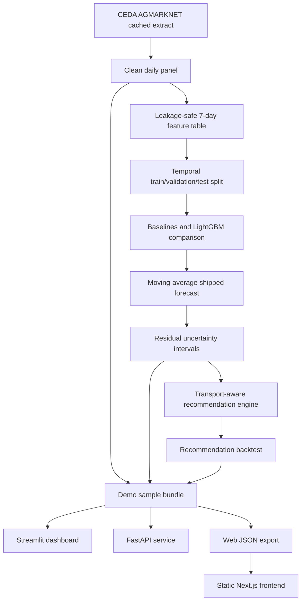

# MandiPulse Architecture

## Current Shape

MandiPulse is an offline-first, transport-cost-aware mandi decision-intelligence system. It uses a
committed demo bundle for public demos and a reproducible local pipeline for regeneration.

Scope:

- Crop: Onion only.
- State: Maharashtra only.
- Markets: 15 selected mandis.
- Forecast horizon: 7 days only.
- Shipped forecaster: `moving_average_7d`.
- Public surfaces: Streamlit dashboard, FastAPI API, and static Next.js frontend.

## Data Flow


```mermaid
flowchart TD
    A["CEDA AGMARKNET cached extract"] --> B["Clean daily panel"]
    B --> C["Leakage-safe 7-day feature table"]
    C --> D["Temporal train/validation/test split"]
    D --> E["Baselines and LightGBM comparison"]
    E --> F["Moving-average shipped forecast"]
    F --> G["Residual uncertainty intervals"]
    G --> H["Transport-aware recommendation engine"]
    H --> I["Recommendation backtest"]
    B --> J["Demo sample bundle"]
    G --> J
    I --> J
    J --> K["Streamlit dashboard"]
    J --> L["FastAPI service"]
    J --> M["Web JSON export"]
    M --> N["Static Next.js frontend"]
```

The model story is intentionally honest: LightGBM and residual-LightGBM were evaluated and did not
beat the 7-day moving-average baseline on the held-out test split, so the baseline remains shipped.

## Storage And Artifact Policy

**CSV is the source of truth; DuckDB is the read interface.**

Pipeline scripts write reproducible CSV outputs. Dashboard, API, and evaluation loaders read CSVs
through `src/mandipulse/data/store.py::read_csv_via_duckdb`, satisfying the DuckDB architecture rule
without requiring a persisted binary database.

Committed artifacts:

- `data/sample/*.csv`: slim clone-runnable demo bundle.
- `web/public/data/*.json`: static frontend data generated from the sample bundle.
- `reports/**/*.md`: human-readable evaluation and data-quality reports.

Ignored local artifacts:

- `data/raw/`, `data/interim/`, `data/processed/`.
- `artifacts/forecasts/`, `artifacts/metrics/`, `artifacts/recommendations/`, `artifacts/models/`.
- `mlruns/` and local build/cache directories.

This keeps the repo small while preserving a no-secrets demo path.

## Runtime Surfaces

| Surface | Role | Data source |
|---|---|---|
| Streamlit | Offline data-science showcase with Overview, Decision, Forecast, and Coverage pages | `data/sample/` fallback or local full artifacts |
| FastAPI | Local snapshot API for `/health`, `/forecast`, and `/recommend`; external deployment is optional | Shared streamlit-free loaders over `data/sample/` |
| Next.js | Static decision-first frontend with client-side decision-input re-ranking; external deployment is optional | `web/public/data/*.json` |

The Next.js ranking code is a TypeScript port of `src/mandipulse/recommend/engine.py`, wrapped by the
same canonical as-of, radius, and alternative-limit policy used by the exporter and API. The parity
test compares the policy-filtered TypeScript output against Python-generated `recommendations.json`
within 0.01 INR/qtl.

## Modeling Boundary

Every forecasting change must preserve:

- Temporal train/validation/test split.
- No future leakage in lag or rolling features.
- Comparison against seasonal naive, moving-average, and Ridge baselines.
- MAE, RMSE, sMAPE, MASE, split dates, and per-mandi reporting.

The shipped model can change only if a candidate beats `moving_average_7d` on held-out test MAE.

## Recommendation Boundary

The recommendation is a decision-support ranking, not a profit guarantee.

```text
expected_net_price = forecast_price - estimated_transport_cost
```

Candidates are ranked by `expected_net_price_inr_qtl` descending (market_id ascending tie-break);
this value is published as `transport_adjusted_net_price_inr_qtl` in export bundle v2.0.0. The
uncertainty penalty is shown as separate evidence only and is not part of the ranking arithmetic:
the public residual interval has one global width, so the penalty is constant across candidates in
the same snapshot. (Pre-v2 exports used a `risk_adjusted_score` column that subtracted this penalty;
that name and formula are superseded.)

Transport cost uses haversine distance, a road-distance factor, and cost-per-km assumptions from
`configs/recommendation.yaml`. Recommendation quality is evaluated with regret@K against a nearest
mandi baseline.

The road-distance factor and cost rate are configurable evaluation assumptions, not routing-engine
distances or carrier quotes. Risk labels and empirical coverage still communicate uncertainty;
expected net price (forecast minus transport cost) drives the current public ranking.

## Optional Stretch Work

The portfolio demo should remain stable before adding research scope. Current optional tracks:

- Milestone O: offline calendar/exogenous features, with arrivals gated on a valid data refresh.
- Milestone P: conformal intervals, compared honestly against current residual intervals.
- Deferred: additional crops/states, 14/30-day horizons, regime/anomaly detection, monitoring, and
  causal claims.
